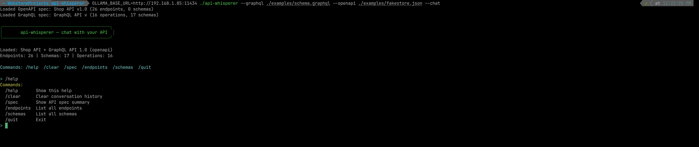

# api-whisperer

Chat with your API specifications using natural language — powered by RAG + Ollama.

Supports **OpenAPI 3.x**, **Swagger 2.0**, and **GraphQL (SDL + introspection)**.

## How It Works

```
spec.yaml / .graphql / URL
         │
         ▼
    Parse (openapi.Parse / graphql.Parse)  → unified ApiSpec model
         │
         ▼
    Serialize to text
         │
         ▼
    Split into chunks (1000 chars each)
         │
         ▼
    Ollama Embed → vector embeddings (one-time at startup)
         │
         ▼
    VectorStore → cosine similarity search (per question)
         │
         ▼
    Question → find relevant chunks → LLM → answer
```

## Demo




## Features

- **Natural language queries** — ask about endpoints, schemas, parameters in plain English or any language
- **Multi-spec support** — load OpenAPI + GraphQL together, query across both
- **Code generation** — ask the LLM to generate Go, TypeScript, curl, or any code from your API spec
- **RAG-powered** — semantic search finds the right part of your spec before each LLM call
- **MCP support** — run as a [Model Context Protocol](https://modelcontextprotocol.io) server for AI agents
- **Lightweight** — no database, no external services (except Ollama)

## Quick Start

```bash
# Build
make build

# Chat with an OpenAPI spec
make run-openapi

# Chat with a GraphQL schema
make run-graphql

# Load both OpenAPI and GraphQL
make run-combined

# Run as MCP server (for AI agents / opencode)
make run-mcp
```

### Manual

```bash
./api-whisperer --openapi ./examples/petstore.yaml --chat
./api-whisperer --graphql ./examples/schema.graphql --chat
./api-whisperer --openapi ./examples/petstore.yaml --graphql ./examples/schema.graphql --chat
./api-whisperer --mcp --openapi ./examples/petstore.yaml

# Load from URL
./api-whisperer --openapi https://petstore.swagger.io/v2/swagger.json --chat
```

## Modes

### Chat (`--chat`)

Interactive CLI with readline:

```
> what endpoints work with users?
> show me the Pet schema
> generate a Go HTTP client for POST /pets
> make a React useQuery hook for products
> give me a curl command for GET /categories
```

All code generation is handled by the LLM — no template-based generators.

### MCP Server (`--mcp`)

Run as a stdio MCP server for AI agents (e.g., [opencode](https://opencode.ai)):

```bash
./api-whisperer --mcp --openapi ./spec.yaml
```

Integration via `opencode.json`:
```json
{
  "mcp": {
    "api-whisperer": {
      "type": "local",
      "command": "./api-whisperer",
      "args": ["--mcp", "--openapi", "./examples/petstore.yaml"]
    }
  }
}
```

### Pipe Mode (read-only)

Commands work via stdin:
```bash
printf "/endpoints\n/quit" | ./api-whisperer --openapi ./examples/petstore.yaml
```

## Chat Commands

| Command | Description |
|---|---|
| `/help` | Show available commands |
| `/clear` | Clear conversation history |
| `/spec` | Show API spec summary |
| `/endpoints` | List all endpoints |
| `/schemas` | List all schemas |
| `/quit` | Exit |

## MCP Tools

| Tool | Params | Description |
|---|---|---|
| `query_api` | `query: string` | Ask a natural language question about the API (RAG + LLM) |
| `describe_endpoint` | `method: string, path: string` | Describe a specific endpoint in detail |
| `list_endpoints` | `tag?: string` | List all endpoints, optionally filtered by tag |

## Parsers

### OpenAPI (`kin-openapi`)
- OpenAPI 3.0 + 3.1
- Swagger 2.0
- File or URL
- Parses: endpoints, parameters, request bodies, response schemas, models

### GraphQL (`gqlparser`)
- SDL (`.graphql`, `.gql`)
- Introspection JSON
- Parses: Query/Mutation/Subscription, types, enums, inputs, arguments

## Configuration

| Env Var | Default | Description |
|---|---|---|
| `OLLAMA_BASE_URL` | `http://localhost:11434` | Ollama server address |
| `OLLAMA_MODEL` | `mistral` | LLM model for generation |
| `OLLAMA_EMBEDDING_MODEL` | `nomic-embed-text` | Model for embeddings |

## Example Questions

```
> what endpoints are related to categories?
> show me the ProductResponse schema
> generate Go types for CreateProductRequest
> give me a curl command for POST /products
> what errors can GET /pets/{id} return?
> generate a React useQuery hook for the products list
> what mutations does the GraphQL API have?
> write TypeScript types for User
```

## Architecture

```
cmd/api-whisperer/main.go   — entry point, CLI flags, mode dispatch
internal/
  model/types.go             — shared data model (ApiSpec, Endpoint, Schema, Field, Operation)
  llm/ollama.go              — Ollama HTTP client (official ollama/api wrapper)
  rag/splitter.go            — recursive character text splitter
  rag/vectorstore.go         — in-memory vector store + cosine similarity
  rag/pipeline.go            — RAG pipeline: split + embed once at startup, embed(query) + search per request
  openapi/parser.go          — OpenAPI 3.x + Swagger 2.0 parser (kin-openapi)
  graphql/parser.go          — GraphQL SDL + introspection parser (gqlparser)
  chat/chat.go               — interactive CLI chat with RAG + LLM
  mcp/server.go              — MCP stdio server (3 tools)
```

## Build

```bash
make build
# or
go build -o api-whisperer ./cmd/api-whisperer
```

Requires Go 1.26+.

## License

MIT
